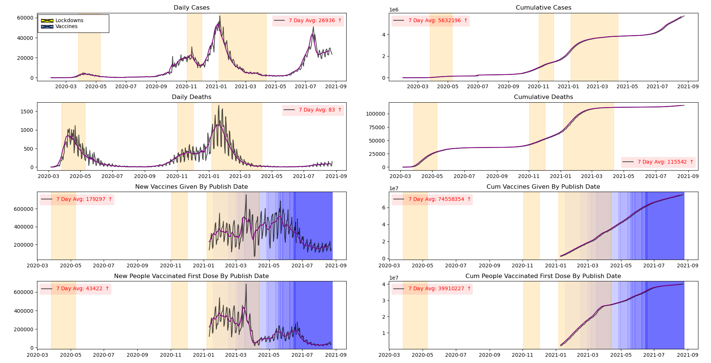

# UK COVID-19 Data Visualisation
## Description
This tool is designed to visualise the data that is available using the Covid-19 API provided by the United Kingdoms government.

I am not currently sure how I am gonna present the data.

##Example Figure:
